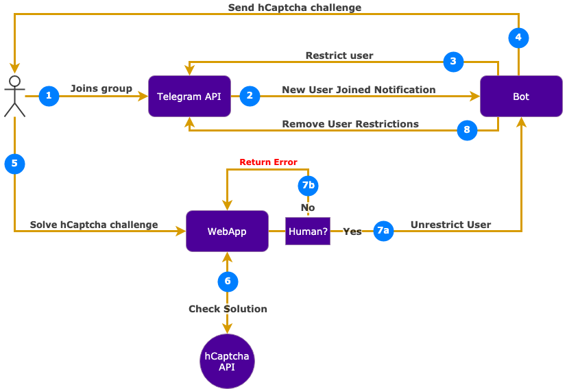

# telegram-hcaptcha-bot
Here’s an example of something very similar:
https://github.com/TG-reCAPTCHA/Telegram-reCAPTCHA-Bot

We want you to have something about as easy to use and install but it should:
- Only voice channel users who solve a captcha
- Be written in python
- Uses HCaptcha instead of recaptcha
- Has good tests and documentation
- Your solution must be cloud agnostic. The above solution uses api gateway and lambda, and we want something which is agnostic of cloud technology

It probably makes sense to reuse an existing bot framework so you don’t have to do it all yourself. If you are doing this as a bounty, please email your contact with your solution and do not expose it to the world. 

# Screenshot

## Screenshots

| Landing page  | Verified | Failed to verify  |
|:-------------:|:-------------:|:-----:|
|   |  |  |

## Workflow example

**Please click to view video**

# Documentation

## How everything is connected

## Signup for a new Telegram bot

1. Create a new bot on telegram and note the `secret token` and the bot `username`: [Creating a new bot - Telegram documentation](https://core.telegram.org/bots#creating-a-new-bot)
1. Create a new account on [hCaptcha](https://www.hcaptcha.com/) and note the `sitekey` and the `secret token`
1. Invite the bot to your Telegram channel and set it as admin

## Setup hCaptcha Telegram Bot

1. Navigate to directory in terminal
1. Rename `.env.sample` to `.env`
1. Set `TELEGRAM_TOKEN`, `TELEGRAM_USERNAME`, `HCAPTCHA_SECRET`, `HCAPTCHA_SITE_KEY` in `.env`
1. [Install `pipenv`](https://docs.pipenv.org/en/latest/install/)
1. Install dependencies: `pipenv install`
1. Enter virtualenv: `pipenv shell`
1. Run tests: `pytest`

## Deployment process

**For this challenge I decided to use heroku for deployment**

1. [Signup for Heroku](https://signup.heroku.com/) and install [Heroku CLI](https://devcenter.heroku.com/articles/heroku-cli#download-and-install)
1. Authenticate to Heroku: `heroku login`
1. Create heroku app: `heroku create` and take note of the app url
1. Set Heroku Buildpack: `heroku buildpacks:set heroku/python`
1. Deploy app: `git push heroku master`
